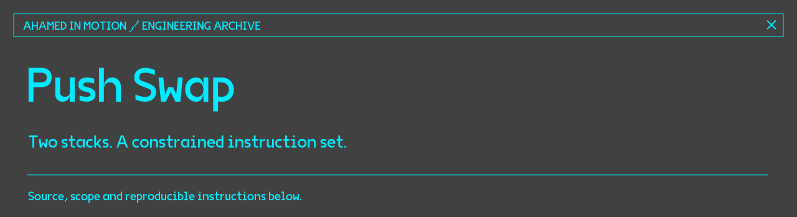

# Push Swap

A sorting program in C that outputs instructions for two stacks. The challenge is to sort the values using only the allowed stack operations.

Built as a 42 software engineering project. The implementation uses linked lists, rank indexing, small-input routines, and chunk-based sorting.

## Build and run

Requires a C compiler and Make.

```sh
make
./push_swap 3 2 1
./push_swap "8 -3 12 0 5"
```

The output is a sequence of operations, one per line. Already sorted input produces no operations. Duplicate values, non-integers, and values outside the signed 32-bit range are rejected with `Error` on standard error.

```sh
make clean    # Remove object files
make fclean   # Remove object files and executable
```

## Approach

1. Parse input into stack A and reject invalid or duplicate values.
2. Replace comparisons of arbitrary values with rank indices.
3. Use dedicated routines for up to five values.
4. For larger inputs, move indexed chunks to stack B, then return the largest remaining index to stack A.

| Files | Responsibility |
| --- | --- |
| `parsing.c`, `split.c` | Argument parsing and validation |
| `indexing.c` | Rank assignment |
| `small.c` | Small-input sorting |
| `sort_chunk.c` | Chunk sorting and rebuilding stack A |
| `swap.c`, `push.c`, `rotations.c`, `reverse_rotations.c` | Stack instructions |
| `utils.c`, `free.c` | Linked-list helpers and memory cleanup |

## Verification

During the October 2026 repository review, the project compiled with `-Wall -Wextra -Werror`. Replaying its emitted operations passed 193 cases: every permutation of one to five values, plus sampled inputs of 10, 50, 100 and 500 values. Duplicate, malformed, and integer-boundary rejection checks also passed.

These are functional checks, not a claim of optimal move counts or formal correctness.

[More engineering work →](https://github.com/Ahamedinmotion)
